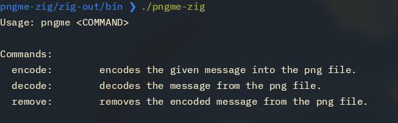
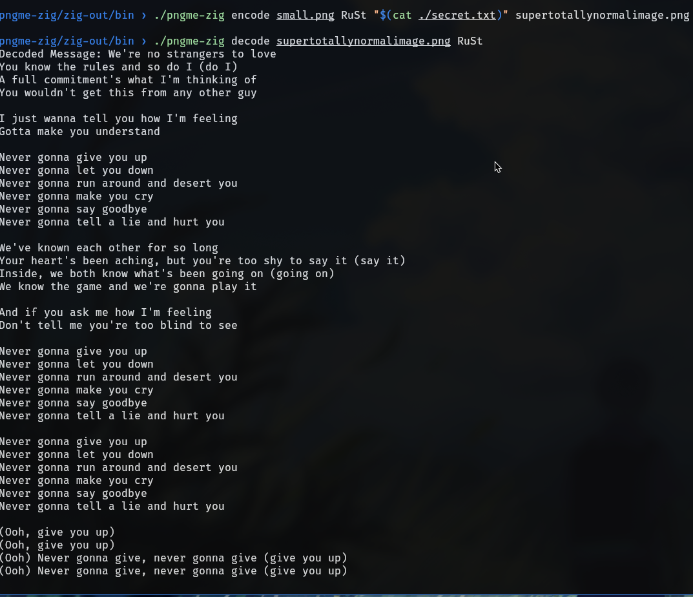
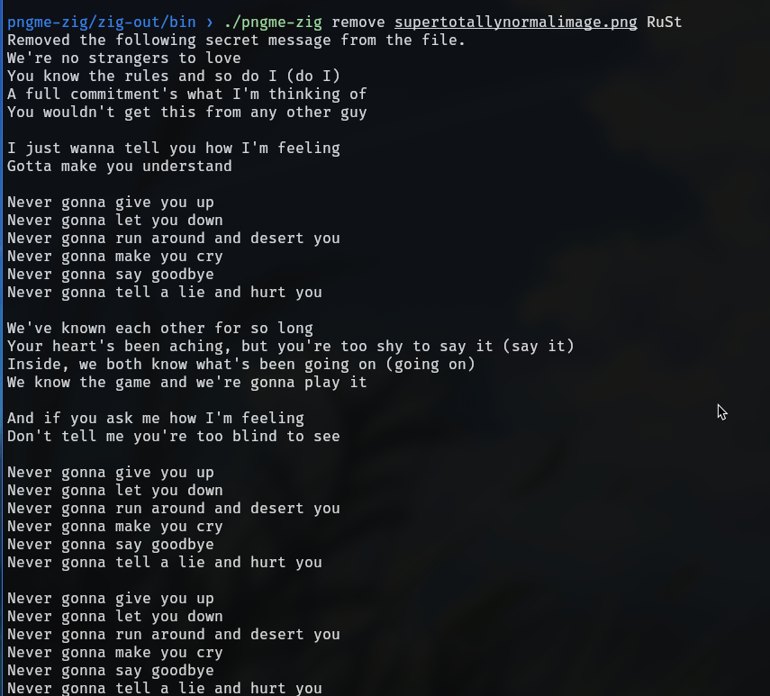
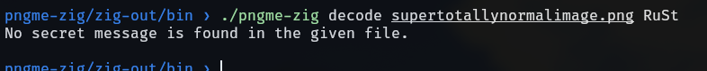

# PngMe (The Zig Version)

## Introduction
This is the implementation of [Pngme project](https://jrdngr.github.io/pngme_book/introduction.html) in Zig. It can encode your secret message into a png file.
Obviously you can decode the message from the file (if you have the secret key) and remove the secret message from the file.

I don't wanna write the whole thing so here are some pictures. I think they are self explanatory.









## Building
### Dependencies
- [Zig](https://ziglang.org/)
- and thats it!

If you know about the flake.nix then I don't even need to tell you what to do.
```sh
git clone https://github.com/faultypointer/pngme-zig.git
cd pngme-zig
zig build
```

## References
The references that you will need to implement pngme is all given in the
[Pngme website](https://jrdngr.github.io/pngme_book/introduction.html). The project's intended
audience are people trying to learn [Rust](https://www.rust-lang.org/) so the resources are specific
to Rust. So here are the resources that I found helpful when implementing it in zig.
- [Zig Language Reference](https://ziglang.org/documentation/0.13.0/)
- [Zig Standard Library Documentation](https://ziglang.org/documentation/0.13.0/std/)
- [Zig guide](https://zig.guide/)
- [Faria, Pedro Duarte. *Introduction to Zig: A Project-Based Book*. 1st ed., December 2024, Belo Horizonte.](https://pedropark99.github.io/zig-book/)
- [Programming in Zig: From Basics to Mastery by Murat Genc](https://gencmurat.com/en/pages/programming-with-zig/)
- [Karl Seguin's Blog](https://www.openmymind.net/)

These are great resources to learn zig. Also clone the zig repo from github and
look through the standrad library documentation. Its really fun and also a great way to learn zig.
